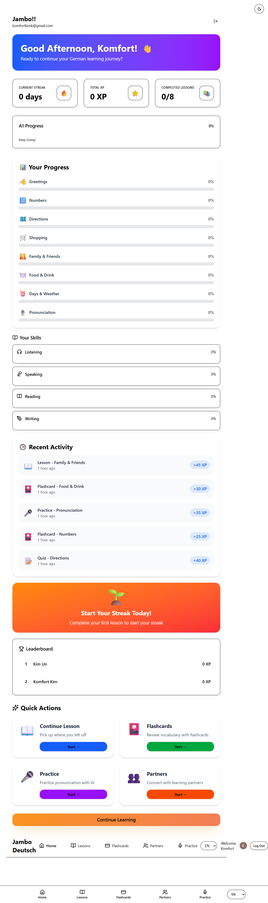

# Jambo Deutsch

Modern MERN stack learning platform for German learners. The project pairs a Clerk-secured Vite/React client with an Express + MongoDB API, complete with lesson content, flashcards, partner discovery, and a real-time messaging experience powered by Socket.IO.

## Live Demo

- Client (production): https://jambo-deutsch-client-production.up.railway.app/
- API (production): https://jambo-deutsch-server-production.up.railway.app/

## Screenshot




## Features

- **Clerk Authentication** with JWT-protected REST and WebSocket endpoints.
- **Dashboard Experience** showcasing streaks, XP, progress, skills, leaderboard, quick actions, and i18n (EN/DE).
- **Lessons & Flashcards** backed by seeded Mongo data and accessible via REST endpoints; includes CEFR A1 topics (greetings, numbers, directions, shopping, family, food, time/weather, pronunciation drills).
- **Partner Discovery** with filters, presence indicators, and profile data (goal, level, location, interests).
- **Real-time Partner Chat** (Socket.IO) with typing indicators, presence, read receipts, and REST history fallbacks.
- **Pronunciation (Sprechen) MVP**: MediaRecorder-based capture with preview, upload, and XP/streak awards for every recording.
- **Pronunciation (Sprechen) MVP**: MediaRecorder-based capture with preview, upload, and XP/streak awards for every recording.
- **Rich UI Enhancements**: theme toggle (persisted across auth screens), polished design tokens, responsive layout, Sonner toasts, bottom navigation.

## Architecture at a Glance

```
client/
 ├─ src/components     # shadcn/ui building blocks, layout shell, nav, chat UI
 ├─ src/context        # Auth + Progress providers
 ├─ src/hooks          # useAuth, usePartnerSocket, MediaRecorder helpers
 ├─ src/pages          # Feature screens (dashboard, lessons, flashcards, partners, pronunciation)
 └─ src/utils          # Axios wrapper, constants, storage helpers, formatters

server/
 ├─ src/controllers    # Auth, lessons, partners, progress, practice, sockets
 ├─ src/data           # Seed data for lessons/flashcards/partners/activities
 ├─ src/middleware     # Clerk protect, validation, error handlers
 ├─ src/models         # User, LessonModule, Flashcard, PartnerProfile, PartnerMessage, Recording, Activity
 ├─ src/routes         # Express routers
 ├─ src/sockets        # Socket.IO auth + partner events
 └─ src/utils          # constants, seed helpers, request parsing
tests/
 └─ content.test.js    # Ensures every module has lessons/flashcards/activities
```

## Tech Stack

- **Client**: Vite + React 19, TypeScript, React Router, Clerk React, Socket.IO client, Tailwind CSS (via @tailwindcss/vite), shadcn/ui primitives, TanStack Query (planned), i18next.
- **Server**: Node.js, Express 5, Socket.IO 4, Clerk SDK, MongoDB/Mongoose, Zod validation, Nodemailer (for future), dotenv.
- **Tooling**: pnpm (client) and npm (server), ESLint, nodemon, dotenvx hints.

## Requirements

- Node.js 18+ (recommended 20+).
- pnpm 9+ (client workspace).
- npm 10+ (server workspace).
- MongoDB connection string (local or Atlas).
- Clerk instance with publishable/secret keys and optional JWT template (e.g., `integration_fallback`).

## Getting Started

### 1. Clone & Install

```bash
git clone <repo-url>
cd Jambo_Deutsch

# Server deps (npm)
cd server
npm install

# Client deps (pnpm)
cd ../client
pnpm install
```

### 2. Environment Variables

#### Server (`server/.env`)
```
PORT=5001
MONGODB_URI=your-local-or-atlas-connection
MONGODBATLAS_URI=optional-secondary-uri
JWT_SECRET=long-random-string
JWT_EXPIRES=7d
CLERK_SECRET_KEY=sk_test_...
CLIENT_ORIGIN=http://localhost:5173
```

> The server seeds lessons/flashcards/partners/activities automatically on start if collections are empty.

### 3. Seeding / Resetting Content

Lesson modules, flashcards, partner profiles, activities, and pronunciation prompts live in `server/src/data`. On first boot they populate Mongo. To reseed:

1. Stop the server.
2. Drop the relevant collections (`lessonmodules`, `flashcards`, `partnerprofiles`, `activities`, `recordings`).
3. Restart `npm run dev` – the seed script detects empty collections and reimports.

#### Client (`client/.env`)
```
VITE_CLERK_PUBLISHABLE_KEY=pk_test_...
VITE_API_URL=http://localhost:5001/api
VITE_SOCKET_URL=http://localhost:5001
VITE_CLERK_TOKEN_TEMPLATE=integration_fallback   # optional
```

### 3. Run the Apps

**Server**
```bash
cd server
npm run dev
# Express + Socket.IO on http://localhost:5001
```

**Client**
```bash
cd client
pnpm dev
# React app on http://localhost:5173
```

> Always start the server before the client so REST calls and Socket.IO connections resolve immediately.

## Messaging Flow

- REST endpoints (`/api/partners/:partnerId/messages`) fetch/send history (protected by Clerk middleware).
- Socket.IO bridge (`/socket.io`) authenticates with Clerk session tokens and emits:
  - `partner:join`, `partner:message`, `partner:typing`, `partner:read`, `partner:presence`.
- Client hook `usePartnerSocket` manages connection state, event subscriptions, and emit helpers.
- Partner list page subscribes to presence updates; the dedicated chat page handles full conversations.

If you see `JWT is expired` in the server logs, sign out/in to refresh the Clerk session token—Socket.IO handshakes require valid tokens just like REST requests.

## API Overview

| Endpoint                    | Method | Description                                                   |
|-----------------------------|--------|---------------------------------------------------------------|
| `/api/auth/me`              | GET    | Return user profile, creating it if necessary                 |
| `/api/auth/register`        | POST   | Sync goal/location/preferences to Mongo user                  |
| `/api/lessons`              | GET    | Lesson metadata (future expansion)                            |
| `/api/flashcards/:module`   | GET    | Flashcards for a module                                       |
| `/api/partners`             | GET    | List partner profiles                                         |
| `/api/partners/:id/messages`| GET    | Fetch conversation history                                    |
| `/api/partners/:id/messages`| POST   | Persist new message                                           |
| `/api/progress/update`      | POST   | Update module percentage + award XP                           |
| `/api/progress/streak`      | POST   | Increment/reset streak                                        |
| `/api/progress/xp`          | POST   | Award XP directly (used after pronunciation uploads)          |
| `/api/practice/recordings`  | POST   | Upload audio via `multer`, storing metadata in Mongo          |

## Scripts

### Server (`npm run <script>`)
- `dev`: nodemon + Express + Socket.IO
- `start`: production start
- `lint`: ESLint
- `test`: Node’s built-in test runner (`node --test`) validating seed content

### Client (`pnpm <script>`)
- `dev`: Vite dev server
- `build`: `tsc -b` + `vite build`
- `preview`: Preview production build
- `lint`: ESLint

## Testing

For now, tests focus on verifying seed data integrity (every module has lessons/flashcards, partner seeds look sane). Run them from `server/`:

```bash
cd server
npm test
```

The plan post-MVP is to expand coverage to controllers and socket events once the API surface stabilizes.

## Testing & Troubleshooting

- Ensure MongoDB is reachable and credentials are correct.
- Confirm Clerk keys and JWT template names match the ones used in `AuthProvider`.
- If Socket.IO fails to connect, verify the server is running and that the client points to the right origin (`VITE_SOCKET_URL`).
- The partner chat view depends on having seeded `PartnerProfile` docs; re-run the server seeding if necessary.

## Roadmap

- Automated content ingestion (Tatoeba sentences, frequency word lists, text-to-speech audio generation).
- Adaptive lesson plans and goal-based recommendations.
- AI-powered pronunciation scoring and transcript feedback.
- Push/email nudges for streak protection and lesson reminders.
- Attachments & voice notes inside partner chat.
- Dedicated analytics dashboard for mentors reviewing learner progress.

## Contributing

1. Create a feature branch.
2. Make clear, grouped commits (see commit suggestions below).
3. Run lint/tests where available.
4. Open a PR describing the feature and testing steps.

Happy building! Holen wir uns Deutsch. 🚀🇩🇪
